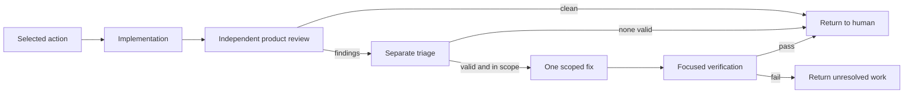

# Workflow and command reference

For first adoption, use the [existing-project guide](adoption.md). [Custom packs](packs.md) and [legacy compatibility](legacy.md) have separate references.

## Default files

```text
AGENTS.md                          project-owned guidance
.agents/
  work.toml                       project-owned bounded state
  AGENTS.reference.md             refreshed guidance reference
  principles.toml                 refreshed principles catalogue
  prompts/
    implementer.md
    reviewer.md
    triager.md
    fixer.md
    verifier.md
  user-prompts/
    adopt.md
    kickoff.md
    review.md
```

Guidance is harness-agnostic. Harness-specific instruction files can point to the project's agreed root guidance rather than duplicate it.

The default creates none of these process artefacts:

- Ledger templates.
- JSON Lines round logs.
- A `docs/plans/` process tree.
- Review directories.
- Plan-review loops or convergence-round state.

The user prompts serve separate human requests:

- `adopt.md` prepares an existing project for human review, without implementation.
- `kickoff.md` starts the selected action and bounded delivery.
- `review.md` requests a standalone read-only review, either a whole tree at one ref or one diff between refs.

The standalone review prompt returns the review directly. It creates no review state and permits reproduction only in human-authorised scratch space outside the reviewed repository.

## Scaffold options

Bare `agent-flow` prints subcommand help. `agent-flow scaffold` prints the proposed asset actions before any write:

- `create` for absent assets.
- `refresh` for existing reference assets.
- `skip (exists)` for existing working files.
- `overwrite` for forced working-file replacement.

On a terminal, `scaffold` opens the principle selector. Save confirms writes, while Cancel or quit writes nothing.

Outside a terminal, writes require `--write`. Without it, the command only prints the plan. `--dry-run` always skips the selector and writes nothing.

```sh
agent-flow scaffold
agent-flow scaffold --output-dir path/to/project --dry-run
agent-flow scaffold --output-dir path/to/project --write
```

Reference assets refresh on each write. Working files remain unchanged unless `--force` accompanies the write. `--force` controls replacement, not write permission.

The default VCS option initialises an empty Git repository only on write. A target already inside a repository does not receive a nested repository. `--vcs none` disables initialisation. Scaffold never commits files.

### Principles

`--principles` accepts comma-separated tokens:

- `default` selects the default subset.
- `all` selects every principle.
- `none` selects no principles.
- `tag:<name>` selects principles with that tag.
- A bare id selects one principle.

The selection removes duplicates and preserves first occurrence order. `--principle-detail` accepts these values:

- `name` for names only.
- `summary` for the default summaries.
- `full` for names with rationale and references.

```sh
agent-flow scaffold --list-principles
agent-flow scaffold --principles all --list-principles
agent-flow scaffold --principles kiss,verify-dont-trust,tag:fp --dry-run
```

The selector starts from `--principles`. Its left pane shows available principles, and its right pane shows the ordered selection.

| Keys | Action |
| --- | --- |
| `i` / `a` | Move the highlighted principle before or after the destination cursor. |
| `Tab` | Switch panes. |
| `h` / `l` | Switch panes. |
| Horizontal arrows | Switch panes. |
| `j` / `k` | Move the cursor. |
| Vertical arrows | Move the cursor. |
| `K` / `J` | Reorder the selection. |
| `u` / `U` | Undo or redo. |
| `/` | Filter available principles. |
| `Enter` | Open confirmation, with Cancel selected. |
| `q` | Abort. |

The filter matches these principle fields:

- Name.
- Id.
- Tag.

Save prints a `--principles <ids>` argument for later reuse.

### Optional checks and hooks

`--module checks` adds product-development tooling:

- A project-owned `.agents/checks.toml`.
- Project-owned ast-grep configuration and an example rule.
- A reference checks-reviewer prompt.
- A reference `.agents/hooks/pre-commit` script.

The script stays inert unless separately installed. `--with-precommit-hook` requires `--module checks` and installs a create-if-absent delegate. It does not overwrite existing hooks or install outside the target project.

`agent-flow checks` runs configured lint and format commands in a temporary Git worktree. `--staged` selects index content rather than tracked working-tree content. The runner does not provide a security sandbox for trusted commands that use absolute paths or mutate Git metadata.

These opt-in tools are neither task state nor proof of review. Permission to read a check configuration does not authorise its execution.

## Bounded work state

`.agents/work.toml` is the only workflow task-state file. Version 1 permits at most five total ordered steps and 4,096 source bytes.

Each step has these fields:

- `id`.
- `status`.
- `blocked_by`.
- `user_problem`.
- `change`.
- `acceptance`, an array of criteria.
- `why_next`.

Statuses use a closed vocabulary:

- `active`.
- `pending`.
- `complete`.

While unfinished work remains, `selected_action` must name exactly one active step. Several steps can be active. An all-complete file omits selection and projects an explicit completed result.

Every blocker must name a step. Active-step blockers must be complete. Pending-step blockers must precede that step and remain active or pending. A pending step cannot block itself.

Prose fields accept TOML multiline strings:

- `user_problem`.
- `change`.
- Each `acceptance` item.
- `why_next`.

Structural values stay on one line. Prose permits line feeds, but all fields reject other control characters and Unicode line or paragraph separators. This includes tabs and carriage returns.

```sh
agent-flow validate --source .agents/work.toml
agent-flow status --source .agents/work.toml
agent-flow status --source .agents/work.toml --json
agent-flow next --source .agents/work.toml
agent-flow next --source .agents/work.toml --json
```

These commands are read-only. With no explicit legacy inputs, an existing `.agents/work.toml` selects bounded mode automatically.

`validate` checks structural invariants and reports source-prefixed errors with a nonzero exit. Review records cannot change its result. Valid syntax does not prove correct intent or independent review.

`status` projects every ordered step with its dependency statuses and the selected action. Human and JSON output fail rather than truncate above 16,384 bytes.

`next` lists every active unit in file order and the selected action's brief. It excludes pending-step prose. Both output formats fail rather than truncate above 8,192 bytes.

All-complete work produces no active units and no selected action. JSON represents that action as `null`. Identical input produces identical output.

Human multiline prose uses an indented `  |` continuation gutter, so embedded prose cannot forge top-level headings. JSON preserves accepted strings exactly, including paragraph breaks.

## Roles are contracts, not isolation

The human selects the action and invokes `kickoff.md`. Delivery uses one `impl/<selected-action>` branch, without parallel implementation worktrees.



Review findings cannot expand acceptance criteria. The workflow stops for these conditions:

- No independent reviewer.
- A finding outside the accepted scope.
- An unsafe fix.
- Failed focused verification.

The role prompts define contracts. agent-flow launches no role agent or process and creates no role worktree. It neither enforces nor detects separation between roles across these boundaries:

- Processes.
- Filesystems.
- Networks.
- Credentials.
- Tool access.

The harness or external runner supplies isolation and independent review. The checks runner's temporary worktree is unrelated to delivery roles.

## Releases and the rename

The minimal workflow remains under [Unreleased](../CHANGELOG.md#unreleased). Published 0.0.4 predates it. Use the [source installation path](../README.md#install-the-current-workflow) for this guide.

`cargo install agent-flow` installs the latest published crate, not necessarily the workflow described here.

The crate and binary used the name `agent-scaffold` through 0.0.2. The [0.0.3 changelog](../CHANGELOG.md#003---2026-08-15) retains the historical upgrade instructions. The 0.0.4 entry corrects its scaffold-layout claim.

Published `agent-scaffold` versions remain installable and un-yanked. The crate name is available for reuse. The contact route is the [project issue tracker](https://github.com/nothingnesses/agent-flow/issues).

Historical force-refresh instructions are not existing-project adoption instructions.

## Development

The repository provides a Nix development shell with its pinned toolchain. `nix develop` enters it, or `direnv allow` enables the reviewed environment.

Common Just recipes are:

```sh
just build
just test
just clippy
just ci
just run -- --help
```

`just ci` runs the same `.agents/checks/ci-gate.sh` as GitHub CI through the locked environment. It includes:

- Rust formatting checks.
- Clippy with warnings denied.
- Locked tests.
- Product checks and bounded-state validation.
- `actionlint`.
- Tripwires for removed process artefacts.
- Scratch tests for attribution rules.
- Attribution checks across complete reachable history.
- A tracked-tree preservation check.

`ATTRIBUTION_TARGET` selects the branch commit when CI checks a pull request merge result.

Use Rust formatting only for changed Rust files. Do not use `just fmt` or `nix fmt` for scoped Rust changes.

That formatter applies Rust 2024 formatting and reflows retained audit records. The accepted Rust check uses `cargo fmt`.
